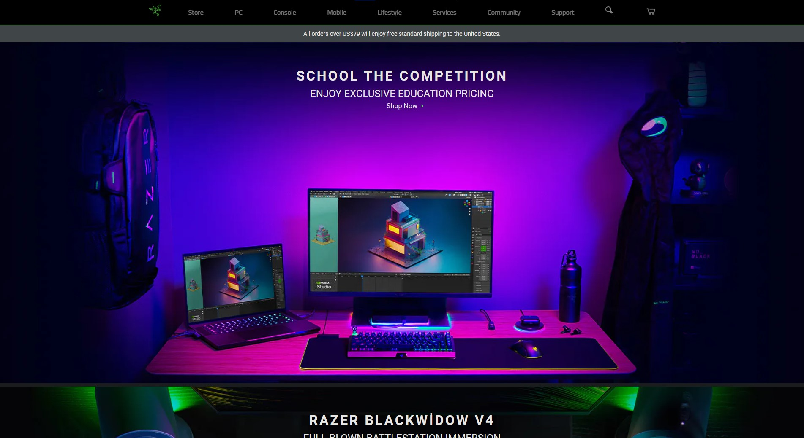

# RAZER
This project is the construction of a clone website. We explored what can be done on Front-End and current technologies.

## Description
Technologies used in website construction.
- HTML
- CSS
- SASS
- JAVASCRIPT

[Razer Clone](https://razer-clone-h1aeo01c2-hsrvms.vercel.app/)